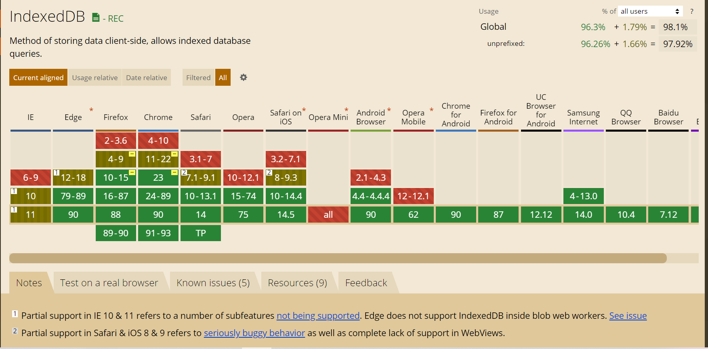

<!--
 * @Author: wangyunbo
 * @Date: 2021-04-28 08:50:00
 * @LastEditors: wangyunbo
 * @LastEditTime: 2021-04-29 12:41:59
 * @Description: file content
 * @FilePath: \indexedBD\readme.md
-->
[npm install idb](https://www.npmjs.com/package/idb)
### IndexedDB简介：    
> IndexedDB是浏览器缓存的一种；    
> 它是一种以 key/value 格式存储的非关系型数据库；    
> IndexedDB是一个异步的API, 也就是说它的操作不会阻塞UI线程。    
> 它支持 transactions 和 versioning    
>浏览器支持情况：    
  

### 对比Cookies 和 Web Storage   
- Cookies 可以缓存很少量的字符串    
- Web Storage 也就是（localStorage 和 sessionStorage , 两个key/value存储，每个站点分配2MB to 10MB的存储）;
sessionStorage不能做到数据保持，当会话结束，缓存的数据就会被清除；localStorage可以在多个会话中保持数据。    
- 数据库对域名是私有的，所以其他的站点无法访问别的站点的IndexedDB的数据。   

### IndexedDB    
- 每个store都包含一定数量的items,这些itmes都有唯一的键名，来快速检索到被标识的数据对象    
- 你可以通过transactions改变这些stores, 譬如 add, edit 和 delete操作。 

### 术语    
- `Database`-是一个数据库，包含多个`object store(用来长久保持数据的)`，通常一个应用对应一个Database.    
- `Object store`- 是一个独立的数据存储对象，就类比于传统的关系型数据库的数据表。通常，一个数据类型（非js的数据类型）对应一个`Object store`。    
> 譬如：一个app需要保持`blog posts`和`user profiles`的数据，就可以把他们想象为两个`object stores`, 和关系型数据库不同的是：值的类型无需统一类型（譬如同一个键名的值可以是 53, `twenty-five`或者`unknown`）.    
- `Index`- index是用来获取数据记录的索引。 
- `Operation` - 是和数据库做交互的操作       
- `Transaction`- 一个transaction包括了一个`operation`或一组`operation`, 确保`数据库的完整性`(数据库完整性（Database Integrity）是指数据库中数据在逻辑上的一致性、正确性、有效性和相容性。)，如果`transaction`中的一个`action`失败了，那么数据库的数据会回退到这个`transaction`开始之前。（在IndexedDB中所有读和写的操作都必须是`transaction`的一部分，这可以保证read-modify-write读-修改-写的操作不受同一时间其他线程操作的影响）    
- `Cursor`- 数据库中多个记录迭代的机理。    


### IndexedDB的使用
1. 通常需要先检测浏览器是否支持IndexedDB：   
```javascript
(() => {
  'use strict'
  if (!('indexedDB' in window)) {
    console.warn('IndexedDB not supported')
    return
  }
//...IndexedDB code
})()
```
2. 打开一个database:  
```javascript
// 这个方法返回一个promise, resolve了一个数据库对象
/**
*@param name 名字
*@param version 版本号
*@param {callback}[upgradeCallback] 可选的回调用来启动database
*/
idb.open(name, version, upgradeCallback)
// 例子：
(function() {
  'use strict';
  if(!('indexedDB' in window)) {
    console.log('当前浏览器不支持IndexedDB');
    return;
  }
  var dbPromise = idb.open('test-db1', 1);
})();
```
3. 使用object stores:    
- 创建一个object stores：   
为了确保数据库完整性，object stores只能在`idb.open`的回调函数中创建和删除，
这个回调接收一个`UpgradeDB`的实例,调用这个实例对象的`createObjectStore`方法来创建`store`对象：
```javascript
/**
* @param {string} name - object store的名字
* @param {object} options - 配置对象
*/
upgradeDB.createObjectStore('storeName', options);
```
> 例子：
```javascript
(function() {
  'use strict';
  if(!('indexedDB' in window)) {
    console.log('当前浏览器不支持IndexedDB');
    return;
  }
  var dbPromise = idb.open('test-db2', 1, function(upgradeDb) {
    console.log('创建一个新的object store');
    // 检查是否存在叫'firstOS'的object store,如果存在还去重复创建会报错
    if(!upgradeDb.objectStoreNames.contains('firstOS')) {
      upgradeDb.createObjectStore('firstOS');
    }
  })
})();
```    
- 定义主键（primary keys）   
> 在定义一个object stores的时候，可以通过定义一个key path来定义主键。（一个key path是一个一直存在且包含唯一值的）。
例子：    
```javascript
// email是唯一的来作为主键
upgradeDb.createObjectStore('people', {keyPath: 'email'});
```   
- 也可以使用一个键生成器`autoIncrement`    
```javascript
upgradeDb.createObjectStore('people', {autoIncrement: true});
// 也可以把自增长的值赋给id属性
upgradeDb.createObjectStore('logs', {keyPath: 'id', autoIncrement:true});
``` 
例子：
```javascript
function() {
  'use strict';

  //check for support
  if (!('indexedDB' in window)) {
    console.log('This browser doesn\'t support IndexedDB');
    return;
  }

  var dbPromise = idb.open('test-db3', 1, function(upgradeDb) {
    if (!upgradeDb.objectStoreNames.contains('people')) {
      upgradeDb.createObjectStore('people', {keyPath: 'email'});
    }
    if (!upgradeDb.objectStoreNames.contains('notes')) {
      upgradeDb.createObjectStore('notes', {autoIncrement: true});
    }
    if (!upgradeDb.objectStoreNames.contains('logs')) {
      upgradeDb.createObjectStore('logs', {keyPath: 'id', autoIncrement: true});
    }
  });
})();
```

- 定义indexes
> indexes 是一个索引，用来从引用的object store中获取数据的一个特殊的属性。
> 一个index存在于引用的object store中并且包含相同的值，但是使用一个区别于引用的store的主键的属性作为keypath.

- 创建一个index
```javascript
// 创建并返回一个index object.
/**
* @param {string} indexName
* @param {string} property - 想要作为索引的属性名
* @param options 配置
*/
objectStore.createIndex('indexName', 'property', options);
```    
例子：    
````javascript
(function() {
  'use strict';

  //check for support
  if (!('indexedDB' in window)) {
    console.log('This browser doesn\'t support IndexedDB');
    return;
  }

  var dbPromise = idb.open('test-db4', 1, function(upgradeDb) {
    if (!upgradeDb.objectStoreNames.contains('people')) {
      var peopleOS = upgradeDb.createObjectStore('people', {keyPath: 'email'});
      peopleOS.createIndex('gender', 'gender', {unique: false});
      peopleOS.createIndex('ssn', 'ssn', {unique: true});
    }
    if (!upgradeDb.objectStoreNames.contains('notes')) {
      var notesOS = upgradeDb.createObjectStore('notes', {autoIncrement: true});
      notesOS.createIndex('title', 'title', {unique: false});
    }
    if (!upgradeDb.objectStoreNames.contains('logs')) {
      var logsOS = upgradeDb.createObjectStore('logs', {keyPath: 'id',
        autoIncrement: true});
    }
  });
})();
```

### 增删改查数据
- 这些操作都是异步的
- 所有的操作都在一个`transaction`中执行。
> 1. 获取数据库对象
> 2. 打开一个`transaction`
> 3. 打开一个`object store`
> 4. 执行增删改查操作

- 创建数据：    
```
// data参数可以是任何js类型,且data必须包含指定的keyPath 且唯一
// 可选参数optionalKey是在createObjectStore的时候未指定keypath的时候才使用的
someObjectStore.add(data, optionalKey);
```
由于在transaction中执行的操作是一个失败就整体回退，所以使用`transaction.complete`来检查整个transaction成功完成。

例子：    
```

dbPromise.then(function(db) {
  var tx = db.transaction('store', 'readwrite');
  var store = tx.objectStore('store');
  var item = {
    name: 'sandwich',
    price: 4.99,
    description: 'A very tasty sandwich',
    created: new Date().getTime()
  };
  store.add(item);
  return tx.complete;
}).then(function() {
  console.log('added item to the store os!');
});
```
- 读数据
> 读数据使用`get`方法    
```
 // 写法： someObjectStore.get(primaryKey);

 dbPromise.then(function(db) {
  var tx = db.transaction('store', 'readonly');
  var store = tx.objectStore('store');
  return store.get('sandwich');
}).then(function(val) {
  console.dir(val);
});
```   
- 更新数据
> 调用`put`方法
```
// someObjectStore.put(data, optionalKey);
dbPromise.then(function(db) {
  var tx = db.transaction('store', 'readwrite');
  var store = tx.objectStore('store');
  var item = {
    name: 'sandwich',
    price: 99.99,
    description: 'A very tasty, but quite expensive, sandwich',
    created: new Date().getTime()
  };
  store.put(item);
  return tx.complete;
}).then(function() {
  console.log('item updated!');
});
```
- 删除数据
> 调用`delete`方法
```
// someObjectStore.delete(primaryKey);
dbPromise.then(function(db) {
  var tx = db.transaction('store', 'readwrite');
  var store = tx.objectStore('store');
  store.delete(key);
  return tx.complete;
}).then(function() {
  console.log('Item deleted');
});

```
- 获取所有的数据，使用`getAll`方法：   
```
// someObjectStore.getAll(optionalConstraint);
dbPromise.then(function(db) {
  var tx = db.transaction('store', 'readonly');
  var store = tx.objectStore('store');
  return store.getAll();
}).then(function(items) {
  console.log('Items by name:', items);
});
```
